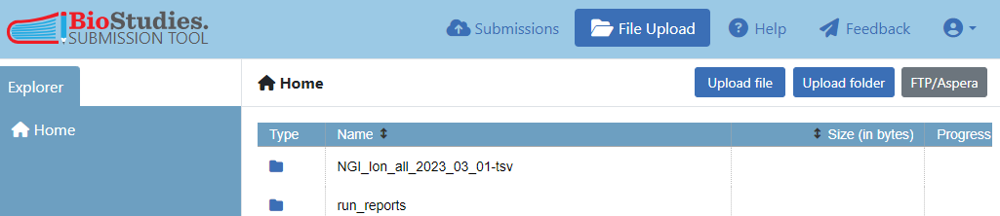
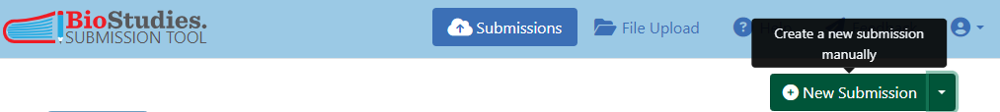

# How to submit SEEK wastewater variant files to BioStudies

During 2021 and 2022, SLU and KTH have done monitoring of SARS-CoV-2 levels and variants in wastewater from six Swedish cities. The sequences have been published in ENA, but the variant analysis and sequencing run reports need to be submitted to BioStudies.

## Links
* [Samples sheet](https://docs.google.com/spreadsheets/d/1iwtpGGobkjkSiowS_QKM-5qo_PB_ngcVsIpUaoJ4TY8/)
* Redmine issue [#6159](https://projects.nbis.se/issues/6159)

## Prepare and upload files

* The variant files are not in excel format, even though the suffixes suggest it (.xls), we changed the suffix to .tsv instead using scripts [go-rename-files.sh](./scripts/go-rename-files.sh) which is calling [rename-files.sh](./scripts/rename-files.sh).
* Not all variant files are needed since not all sequences have been submitted to ENA, so a selection was made and put in [NGI_Ion_all_2023_03_01](./data/NGI_Ion_all_2023_03_01.zip)

* I created a simple [data dictionary](./data/data-dictionary-varType_tables.txt), to explain what the column headers mean. It could be enhanced with references to ontologies or doi:s though.

* I selected the corresponding sequencing run reports, and renamed them in order to resemble the names of the variant files, and put them in folder [run_reports](./data/run_reports.zip)

* I created a table listing the connection between the run reports, variant files, and ENA run accessions, and put them both as [pdf](./data/table-data_files-ENA_links.pdf) and as [txt](./data/table-data_files-ENA_links.txt)

* All these files and folders were then uploaded to BioStudies, to the Files area, via the web browser:


  * Click on `File Upload`, from the top-most menu, then click on either `Upload file` or `Upload folder`, select the file/folder to be uploaded, and then click on `Upload`

  **Note:** If there had been larger files to be uploaded, it is possible to upload using FTP or Aspera. You will need to know your secret directory to be able to upload data into your BioStudies Files area. This can be obtained by clicking on the FTP/Aspera button and following the instructions.

## Create a study

Create a study via the web browser:

* Go to [submission page](https://www.ebi.ac.uk/biostudies/submissions/) and click on the green `New Submission` button 

  

* Select the `Default` collection, then click on the `Add` button
* Add title, release date, description, organism (we used both `SARS-CoV-2` and `Severe acute respiratory syndrome coronavirus 2`)
* Add all three professors involved as authors (i.e. the role)
* Link to the ENA project in Links section: `ena:PRJEB60156` with description `ENA Project`
* It is possible to link to bins of run accession numbers in ENA, e.g. https://www.ebi.ac.uk/ena/browser/view/ERR11201044-ERR11201046 will show all three accessions, see also [EBI help on files](https://www.ebi.ac.uk/bioimage-archive/help-file-list/). Since all current accession numbers can be captured in 4 such bins, add also these as links:
  ```
  Link							Description
  ena:ERR11197160-ERR11197163	    ENA Run accessions
  ena:ERR11201044-ERR11201057	    ENA Run accessions
  ena:ERR11280793-ERR11280822	    ENA Run accessions
  ena:ERR11280825-ERR11281131	    ENA Run accessions
  ```

  **Note:** All repositories which are found in https://identifiers.org can have this short style of writing, but it is possible to write a full URL as well.

* List/add all the files and folders, that were uploaded to the files area, in the Files section. Note that for the variant files and the run reports, the folder is listed, not the individual files. The type column could be either a short description or the file format, I chose to put the file format since the description field is enough.
  ```
  File                                Description                                                                                           Type
  data-dictionary-VarType_tables.txt  Data dictionary describing the column headers of the variant data file(s)                             txt
  table-data_files-ENA_links.pdf      Table listing links between the variant files, sequencing run reports, and ENA run accession numbers  pdf
  table-data_files-ENA_links.txt      Table listing links between the variant files, sequencing run reports, and ENA run accession numbers  txt
  run_reports                         Sequencing run reports                                                                                pdf
  NGI_Ion_all_2023_03_01              SARS-CoV-2 variant analysis                                                                           tsv
  ```

* Check that the validation (left-hand side) section is happy and click on the green `Submit` button in the top right corner.

* You will obtain an email response with a link to the record in BioStudies (typically visible within 24 hours), e.g.: 

  <https://www.ebi.ac.uk/biostudies/studies/S-BSST1185>

## Update an existing study

It is possible to update a study, (all fields can be updated, either changing, removing or adding). Log in to [BioStudies](https://www.ebi.ac.uk/biostudies/submissions/signin?next=%2F), go to your [list of submitted studies](https://www.ebi.ac.uk/biostudies/submissions/), and click on the pen / edit button in the `Actions` field, do whatever updates you like and then click on the green `Re-submit` button up in the right corner. Any updates might take a while before it is visible, up to 24 hours.
