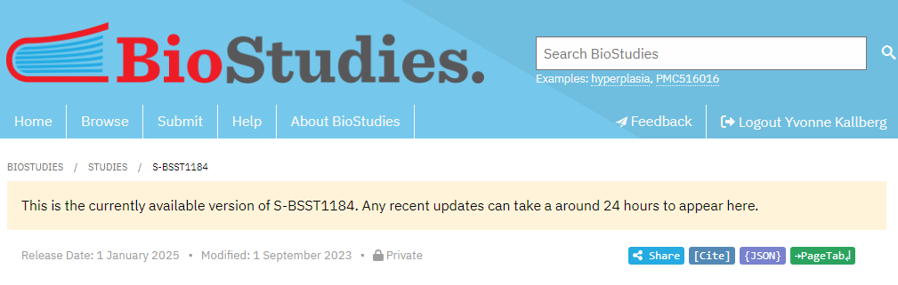
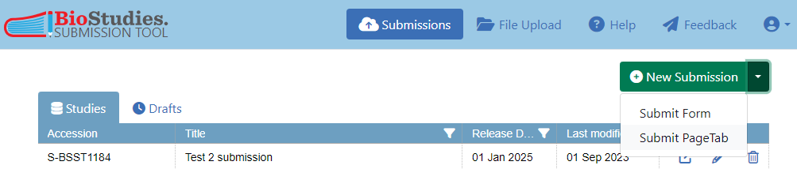
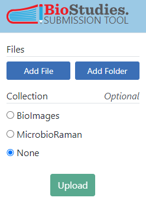
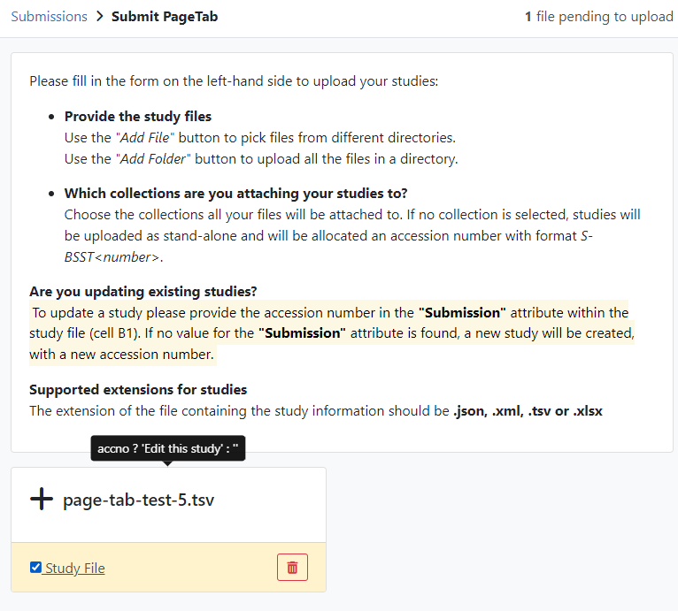

# About submitting to BioStudies using PageTab

## Links

* [file with PageTab info](https://www.ebi.ac.uk/biostudies/misc/SubmissionFormatV5a.pdf) - might be outdated
* [BioStudies - GitHub](https://github.com/EBIBioStudies/EBIBioStudies.github.io)
* [BioStudies-PageTab-Example](https://ebibiostudies.github.io/page-tab-specification/examples/AllInOneExample.html)
* [BioStudies-PageTab-Specification](https://ebibiostudies.github.io/page-tab-specification/specification/PageTabSpecification.html)
* [Submit help for BioImage Archive](https://www.ebi.ac.uk/bioimage-archive/submit/) - uses BioStudies
* [File List Guide](https://www.ebi.ac.uk/bioimage-archive/help-file-list/) - BioImage Archive but shows how to organise files for BioStudies in PageTab format
* [BioStudies database: aggregating all outputs of a life sciences study](https://www.ebi.ac.uk/training/events/biostudies-database-aggregating-all-outputs-life-sciences-study)
* [A guide to organising data associated to a publication using BioStudies](https://www.ebi.ac.uk/training/events/guide-organising-data-associated-publication-using-biostudies)


## Submission steps

It is possible to do the whole submission via the web browser, see [wastewater example](./instructions-submit-biostudies.md). However, if there are many data files or links to be submitted (in the case of wastewater we opted to list folders and not the individual 355 variant files, and corresponding run reports), there is a possibility to submit a file with tables of all data files and links, using PageTab submission.

Although it is possible to submit a whole study from scratch using PageTab, I would suggest doing an initial submission using the web browser, and then use PageTab to populate the files and links section.

**Note:** I *think* that you have to add at least one file, otherwise the validation won't be happy.

The steps below gives an example on adding ENA run accession numbers in the links section of a study, and some variant files (assumed to already be uploaded) in the data/file section:

### Get and update the PageTab file

* View existing study in your browser, by adding the study accession number in the following path: https://www.ebi.ac.uk/biostudies/studies/ (e.g. https://www.ebi.ac.uk/biostudies/studies/S-BSST1158)

* Click on the green `PageTab` button in the right corner, in order to save your study in page tab format

  

* Open the downloaded file (e.g. [S-BSST1158](./data/S-BSST1158.tsv) ) in your favourite editor (capable of reading tsv format files)

  **Note:** The second column on the first row will have the study accession number. If this value is removed / missing, it will be interpreted as if you want to do a submission of a new study (i.e. not adding on to an existing one).

  **Note:** Do not remove anything in this file, if you do, the values you remove will also be removed at BioStudies when submitting the pagetab file.

* Under the last `Link` section in the file, insert a section, separated by an empty row both above and below, where the first row is (note: check if the files and links tables can be added last in the file, would be easier to instruct):
  ```
  Files	Description	Type
  ```
* Then, on the following rows, add the ENA run accessions associated with the variant files, e.g.
  ```
  ERR11201044	ENA Run	ena
  ERR11201045	ENA Run	ena
  ERR11197160	ENA Run	ena
  ```
* Note that there are tabs between the columns
* **Note:** It is possible to have a span of run accession numbers, e.g. https://www.ebi.ac.uk/ena/browser/view/ERR11201044-ERR11201046 will show all three accessions, see also [EBI help on files](https://www.ebi.ac.uk/bioimage-archive/help-file-list/):

  ```
  ERR11201044-ERR11201046	ENA Run	ena
  ```
* Do the same for the variant files, i.e. under the last File section, insert the following section:
  ```
  Files	Description	Type	
  NGI_Ion_all_2023_03_01-tsv/is_170_003.varType.table.tsv	Variant data is_170_003 collected week 44 in Kalmar	Variant file
  NGI_Ion_all_2023_03_01-tsv/is_170_004.varType.table.tsv	Variant data is_170_004 collected week 44 in Örebro	Variant file
  ```

### Submit the PageTab file

* Click on [submissions](https://www.ebi.ac.uk/biostudies/submissions/)
* Click on the down-arrow on the green button `New Submission` and select `Submit PageTab`
  
* Click on the blue button `Add File` to the left and select the page tab file created in previous step
    
* Click the `Study File` box
  
* Click on the green `Upload` button on the left-hand side
