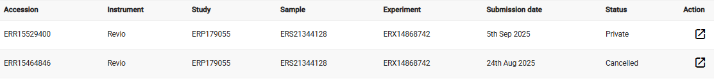

# BGE - *Colletes cyprius*

## Submission task description
Submission of raw reads for *Colletes cyprius* to facilitate assembly and annotation as part of ERGA (https://www.erga-biodiversity.eu/) - BGE (https://biodiversitygenomics.eu/). HiFi, Hi-C and RNAseq datasets will be produced and submitted. There will also be an assembly to be submitted. For BGE projects there will be no annotation done, instead this will be handled by Ensembl. The sample used for sequencing has already been submitted via COPO.
Submission will be (attempted) done via CNAG script and programmatic submission route using xml files produced by the script.

## Procedure overview and links to examples

* [Metadata template](./data/BGE-Colletes-cyprius-metadata.xlsx)
* [BGE HiFi metadata](./data/iyColCypr-HiFi.tsv)
* [BGE HiC metadata](./data/iyColCypr-HiC.tsv)
* [BGE RNAseq metadata](./data/iyColCypr-RNAseq.tsv)

## Lessons learned
<!-- What went well? What did not went so well? What would you have done differently? -->
* Learned how to solve issues with missing file. The files weren't missing but due to a typo in the file names of the runs.xml files, there was a mismatch btw xml files and the files in the upload area at ENA. See further [correcting-missing-file-issue](#correcting-missing-file-issue) below.

## Detailed step by step description

### Submit HiFi
#### Preparations
* Sample ID gave BioSample ID via ERGA tracker portal
* The data files were transferred together with other species received in this batch, using `lftp webin2.ebi.ac.uk -u Webin-39907` and `mput *.bam` and added ToLID to the files using rename function in FileZilla, to make it easier to see that right files will be submitted per species.
#### XML
* I created [iyColCypr-HiFi.tsv](./data/iyColCypr-HiFi.tsv)
* Run script:
    ```
    ../../../../ERGA-submission/get_submission_xmls/get_ENA_xml_files.py -f iyColCypr-HiFi.tsv -p ERGA-BGE -o iyColCypr-HiFi
    ```

* Study is private, so submission.xml with hold date is used.

* Submit both projects and experiment in one go, i.e:
    ```
    curl -u username:password -F "SUBMISSION=@submission.xml" -F "PROJECT=@iyColCypr-HiFi.study.xml" -F "EXPERIMENT=@iyColCypr-HiFi.exp.xml" -F "RUN=@iyColCypr-HiFi.runs.xml" "https://www.ebi.ac.uk/ena/submit/drop-box/submit/"
    ```
* Receipt:
    ```
    <?xml version="1.0" encoding="UTF-8"?>
    <?xml-stylesheet type="text/xsl" href="receipt.xsl"?>
    <RECEIPT receiptDate="2025-08-24T10:55:41.020+01:00" submissionFile="submission.xml" success="true">
        <EXPERIMENT accession="ERX14868742" alias="exp_iyColCypr_HiFi_WGS_LV6000911886_pr_238_001" status="PRIVATE"/>
        <RUN accession="ERR15464846" alias="run_iyColCypr_HiFi_WGS_LV6000911886_pr_238_001_bam_1" status="PRIVATE"/>
        <PROJECT accession="PRJEB96312" alias="erga-bge-iyColCypr-study-rawdata-2025-08-22" status="PRIVATE" holdUntilDate="2026-03-07Z">
            <EXT_ID accession="ERP179055" type="study"/>
        </PROJECT>
        <PROJECT accession="PRJEB96313" alias="erga-bge-iyColCypr3_primary-2025-08-22" status="PRIVATE" holdUntilDate="2026-03-07Z">
            <EXT_ID accession="ERP179056" type="study"/>
        </PROJECT>
        <SUBMISSION accession="ERA34526366" alias="SUBMISSION-24-08-2025-10:55:40:854"/>
        <MESSAGES>
            <INFO>All objects in this submission are set to private status (HOLD).</INFO>
        </MESSAGES>
        <ACTIONS>ADD</ACTIONS>
        <ACTIONS>HOLD</ACTIONS>
    </RECEIPT>    
    ```
* Add accession numbers & update status in SciLifeLab [sheet](https://docs.google.com/spreadsheets/d/1mSuL_qGffscer7G1FaiEOdyR68igscJB0CjDNSCNsvg/), update status in BGE [tracking sheet](https://docs.google.com/spreadsheets/d/1IXEyg-XZfwKOtXBHAyJhJIqkmwHhaMn5uXd8GyXHSpY/)

### Submit HiC
#### Preparations
* Sample ID gave BioSample ID via ERGA tracker portal
* The data files were transferred together with other species received in this batch, using `lftp webin2.ebi.ac.uk -u Webin-39907` and `mput Sample*/*.fastq.gz` and added ToLID to the files using rename function in FileZilla, to make it easier to see that right files will be submitted per species.

#### XML
* I created [iyColCypr-HiC.tsv](./data/iyColCypr-HiC.tsv)
* Run script:
    ```
    ../../../../ERGA-submission/get_submission_xmls/get_ENA_xml_files.py -f iyColCypr-HiC.tsv -p ERGA-BGE -o iyColCypr-HiC
    ```
* Update -HiC.exp.xml to reference accession number of previously registered study:
    ```
    <STUDY_REF accession="PRJEB96312"/>
    ```
* Remove row `<PAIRED/>` (error in script)
* I added 'Illumina' to the library name, since the other data types have the platform named
* Study will be private, so submission.xml with hold date is used.
* Submit using curl:
    ```
        curl -u username:password -F "SUBMISSION=@submission.xml" -F "EXPERIMENT=@iyColCypr-HiC.exp.xml" -F "RUN=@iyColCypr-HiC.runs.xml" "https://www.ebi.ac.uk/ena/submit/drop-box/submit/"
    ```
* Receipt:
    ```
       <RECEIPT receiptDate="2025-08-25T13:44:39.125+01:00" submissionFile="submission.xml" success="true">
     <EXPERIMENT accession="ERX14869353" alias="exp_iyColCypr_Hi-C_LV6000911894_HC041-1A1A" status="PRIVATE"/>
     <RUN accession="ERR15465458" alias="run_iyColCypr_Hi-C_LV6000911894_HC041-1A1A_fastq_1" status="PRIVATE"/>
     <SUBMISSION accession="ERA34671599" alias="SUBMISSION-25-08-2025-13:44:38:987"/>
     <MESSAGES>
          <INFO>All objects in this submission are set to private status (HOLD).</INFO>
     </MESSAGES>
     <ACTIONS>ADD</ACTIONS>
     <ACTIONS>HOLD</ACTIONS>
     <RECEIPT/>
    ```
* Add accession numbers & update status in SciLifeLab [sheet](https://docs.google.com/spreadsheets/d/1mSuL_qGffscer7G1FaiEOdyR68igscJB0CjDNSCNsvg/), update status in BGE [tracking sheet](https://docs.google.com/spreadsheets/d/1IXEyg-XZfwKOtXBHAyJhJIqkmwHhaMn5uXd8GyXHSpY/)

### Submit RNAseq - **TODO**
#### Preparations
* Sample ID gave BioSample ID via ERGA tracker portal
* The data files were transferred together with other species received in this batch, using `lftp webin2.ebi.ac.uk -u Webin-39907` and `mput Sample*/*.fastq.gz` and added ToLID to the files using rename function in FileZilla, to make it easier to see that right files will be submitted per species.

#### XML
* I created [iyColCypr-RNAseq.tsv](./data/iyColCypr-RNAseq.tsv)
* Run script:
    ```
    ../../../../ERGA-submission/get_submission_xmls/get_ENA_xml_files.py -f iyColCypr-RNAseq.tsv -p ERGA-BGE -o iyColCypr-RNAseq
    ```
* Update -RNAseq.exp.xml to reference accession number of previously registered study:
    ```
    <STUDY_REF accession="PRJEB96312"/>
    ```
* Remove row `<PAIRED/>` (error in script)
* I added 'Illumina' to the library name, since the other data types have the platform named
* Study is private, so submission.xml with hold date is used.
* Submit using curl:
    ```
        curl -u username:password -F "SUBMISSION=@submission.xml" -F "EXPERIMENT=@iyColCypr-RNAseq.exp.xml" -F "RUN=@iyColCypr-RNAseq.runs.xml" "https://www.ebi.ac.uk/ena/submit/drop-box/submit/"
    ```
* Receipt:
    ```

    ```
* Add accession numbers & update status in SciLifeLab [sheet](https://docs.google.com/spreadsheets/d/1mSuL_qGffscer7G1FaiEOdyR68igscJB0CjDNSCNsvg/), update status in BGE [tracking sheet](https://docs.google.com/spreadsheets/d/1IXEyg-XZfwKOtXBHAyJhJIqkmwHhaMn5uXd8GyXHSpY/)

### Umbrella project
For each of the BGE species, an **umbrella** project has to be created and linked to the main BGE project, [PRJEB61747](https://www.ebi.ac.uk/ena/browser/view/PRJEB61747).

1. Release the child project via browser
1. Collect scientific name and tolId from the metadata template sheet
1. Go to [ENA browser](https://www.ebi.ac.uk/ena/browser/home) and enter the scientific name as search term
    1. To the left side, there should be a **Taxon** subheading, that gives the identifier
1. Copy experiment accession number from metadata in top of this README
* There is a CNAG script, that should do the deed of creating the xml file:
    ```
    ../../../../ERGA-submission/get_submission_xmls/get_umbrella_xml_ENA.py -s "Colletes cyprius" -t iyColCypr3 -p ERGA-BGE -c SCILIFELAB -a PRJEB96312 -x 3229145
    ```
    Explanation of arguments:
    * -s: scientific name e.g. "Lithobius stygius"
    * -t: tolId e.g. qcLitStyg1
    * -a: the accession number of the raw reads project e.g. PRJEB76283
    * -x: NCBI taxonomy id e.g. 2750798

* Copy `submission-umbrella.xml` from any of the previous BGE species, check that the hold date is as wanted.
* Submit using curl:
    ```
    curl -u Username:Password -F "SUBMISSION=@submission-umbrella.xml" -F "PROJECT=@umbrella.xml" "https://www.ebi.ac.uk/ena/submit/drop-box/submit/"
    ```
* Receipt:
    ```
    <?xml version="1.0" encoding="UTF-8"?>
    <?xml-stylesheet type="text/xsl" href="receipt.xsl"?>
    <RECEIPT receiptDate="2025-08-25T15:30:02.708+01:00" submissionFile="submission-umbrella.xml" success="true">
        <PROJECT accession="PRJEB96369" alias="erga-bge-iyColCypr-study-umbrella-2025-08-25" status="PRIVATE" holdUntilDate="2026-03-07Z"/>
        <SUBMISSION accession="ERA34683354" alias="SUBMISSION-25-08-2025-15:30:02:549"/>
        <MESSAGES>
            <INFO>All objects in this submission are set to private status (HOLD).</INFO>
        </MESSAGES>
        <ACTIONS>ADD</ACTIONS>
        <ACTIONS>HOLD</ACTIONS>
    </RECEIPT>    
    ```
* Release the umbrella by adding the umbrella project accession number from the receipt above in file [submission-release-project.xml](./data/submission-release-project.xml)
* Submit using curl:
    ```
    curl -u Username:Password -F "SUBMISSION=@submission-release-project.xml" "https://www.ebi.ac.uk/ena/submit/drop-box/submit/"
    ```
* Receipt:
    ```
    <?xml version="1.0" encoding="UTF-8"?>
    <?xml-stylesheet type="text/xsl" href="receipt.xsl"?>
    <RECEIPT receiptDate="2025-08-25T15:30:47.402+01:00" submissionFile="submission-release-project.xml" success="true">
        <MESSAGES>
            <INFO>project accession "PRJEB96369" is set to public status.</INFO>
        </MESSAGES>
        <ACTIONS>RELEASE</ACTIONS>
    </RECEIPT>    
    ```

* **Note:** Add the assembly project `` when it has been submitted and made public, see [ENA docs](https://ena-docs.readthedocs.io/en/latest/faq/umbrella.html#adding-children-to-an-umbrella) on how to update.

## Correcting missing file issue
Processing of the .bam file (HiFi) failed and an email was sent to us from ENA that the file was missing. The problem was that in the iyColCypr-HiFi.runs.xml the file name had a space in it (due to copy paste error). I could try add that space in the file name of the uploaded file, but that (if it even would work) might cause problems in the future reuse, if people download the file to a unix system (which really doesn't like space in file names).

First attempt at correction was to edit the run file via the browser, but that was not allowed.

I then tried to do the same via curl (not expecting it to work):
1. I created [iyColCypr-HiFi.runs-modified.xml](./data/iyColCypr-HiFi.runs-modified.xml), with the only difference between the files was a correct file name, and a [submission-modify.xml](./data/submission-modify.xml) with the action MODIFY
1. I then submitted via curl:
    ```
    curl -u username:password -F "SUBMISSION=@submission-modify.xml" -F "RUN=@iyColCypr-HiFi.runs-modified.xml" "https://www.ebi.ac.uk/ena/submit/drop-box/submit/"
    ```
1. Receipt:
    ```
    <?xml version="1.0" encoding="UTF-8"?>
    <?xml-stylesheet type="text/xsl" href="receipt.xsl"?>
    <RECEIPT receiptDate="2025-09-05T08:08:15.406+01:00" submissionFile="submission-modify.xml" success="false">
        <RUN alias="run_iyColCypr_HiFi_WGS_LV6000911886_pr_238_001_bam_1" status="PRIVATE"/>
        <SUBMISSION alias="SUBMISSION-05-09-2025-08:08:15:381"/>
        <MESSAGES>
            <ERROR>In filename: "iyColCypr_m84045_250708_202206_s4.hifi_reads.bc2108.bam", filetype: "bam". File names are not allowed to change during update. Missing file name: iyColCypr_m84045_250708_202206_s4.hifi_reads.bc2108.bam.</ERROR>
        </MESSAGES>
        <ACTIONS>MODIFY</ACTIONS>
    </RECEIPT>
    ```
Next attempt was to cancel the current run, then submit a new run (i.e. not involving the experiment):
1. Cancel the current run by creating a [submission-cancel.xml]() and submit using curl:
    ```
    curl -u Username:Password -F "SUBMISSION=@submission-cancel.xml" "https://www.ebi.ac.uk/ena/submit/drop-box/submit/"
    ```
    * Receipt:
        ```
        <?xml version="1.0" encoding="UTF-8"?>
        <?xml-stylesheet type="text/xsl" href="receipt.xsl"?>
        <RECEIPT receiptDate="2025-09-05T08:22:13.287+01:00" submissionFile="submission-cancel.xml" success="true">
            <MESSAGES>
                <INFO>RUN accession "ERR15464846" is set to cancelled status.</INFO>
            </MESSAGES>
            <ACTIONS/>
        </RECEIPT>
        ````
1. Create a new run file, with a new alias (and correct file name) [iyColCypr-HiFi.runs-new.xml](./data/iyColCypr-HiFi.runs-new.xml) and submit via curl:
    ```
    curl -u username:password -F "SUBMISSION=@submission.xml" -F "RUN=@iyColCypr-HiFi.runs-new.xml" "https://www.ebi.ac.uk/ena/submit/drop-box/submit/"
    ```
    * Receipt:
    ```
    <?xml version="1.0" encoding="UTF-8"?>
    <?xml-stylesheet type="text/xsl" href="receipt.xsl"?>
    <RECEIPT receiptDate="2025-09-05T08:35:20.124+01:00" submissionFile="submission.xml" success="true">
        <RUN accession="ERR15529400" alias="run2_iyColCypr_HiFi_WGS_LV6000911886_pr_238_001_bam_1" status="PRIVATE"/>
        <SUBMISSION accession="ERA34894186" alias="SUBMISSION-05-09-2025-08:35:19:931"/>
        <MESSAGES/>
        <ACTIONS>ADD</ACTIONS>
    </RECEIPT>
    ```
1. **Note:** The reason for a *new* alias is *"Each submitted object is uniquely identified within a submission account using the alias attribute. Once an object has been submitted no other object of the same type can use the same alias within the submission account."* [[ENA documentation](https://ena-docs.readthedocs.io/en/latest/submit/general-guide/programmatic.html#identifying-objects)]
1. I checked what the experiment looks like at ENA, and it seems correct:
    
1. Update accession number of run file in SciLifeLab [sheet](https://docs.google.com/spreadsheets/d/1mSuL_qGffscer7G1FaiEOdyR68igscJB0CjDNSCNsvg/)
