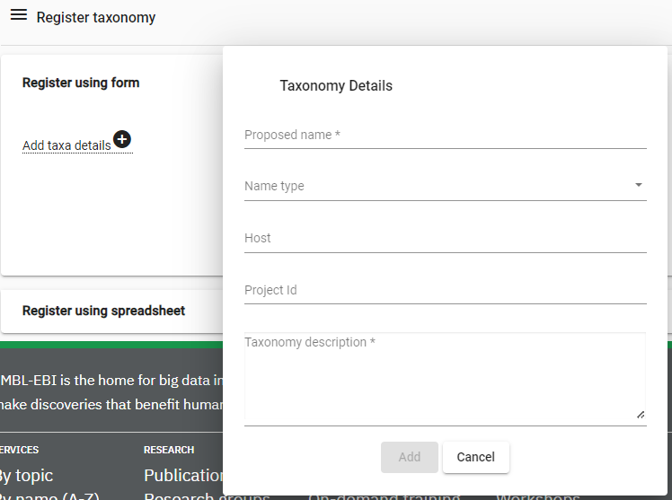
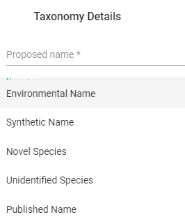

# Register new taxonomy at ENA

In situations where e.g. a symbiont have been identified and assembeled, a new taxonomy needs to be registered previous to submitting the assembly.

* [ENA on registering taxonomy](https://ena-docs.readthedocs.io/en/latest/faq/taxonomy_requests.html)

* [Login](https://www.ebi.ac.uk/ena/submit/webin/login) to ENA, using the broker account, and go to [Register taxonomy](https://www.ebi.ac.uk/ena/submit/webin/taxonomy) in the Samples menu.





* Instructions from ENA:
    * `proposed_name`: the organism name (mandatory). We will check if there is a taxa registered with the given name.
    * `name_type`: allowed taxon name types are:
    
    * `host`: host associated with the taxon, if applicable
    * `project_id`: project associated with the taxa, if applicable
    * `description`: a short description of the taxon, please provide an authority or publication where available, or any other information describing the organism

* Below is an example of registering a taxonomy for the Wolbachia endosymbiont identified when *Stylops ater* was assembeled as part of the ERGA pilot:

    ```
    Proposed name: Wolbachia endosymbiont of Stylops ater
    Name type: Unindentified Species
    Host: Stylops ater
    Project Id: PRJEB70320
    Taxonomy description: Hertig, M. "The rickettsia, Wolbachia pipientis (gen. et sp. n.) and associated inclusions of the mosquito, Culex pipiens." Parasitol. (1936) 28:453-486.
    ```
* **Note:** The approval for the above example took about a month, and the emails (auto-reply and confirmation of the approval) was only sent to the main correspondent of the broker account.