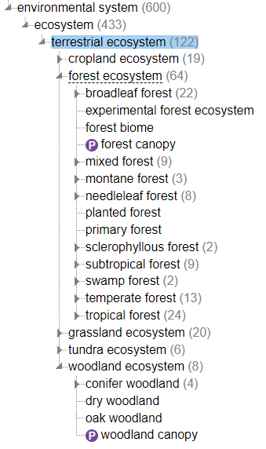

# VR-EBP - *Porodaedalea chrysoloma*

## Submission task description
Within the VR-EBP (Earth Biogenome Project), granticka, *Porodaedalea chrysoloma*, is to be submitted. There are raw reads in form of HiFi sequences, an annotated genome assembly and a mito assembly. An umbrella project will be created to collect the two assemblies.

## Procedure overview and links to examples

* A previous VR-EBP submission: [Coregonus albula (European cisco), PRJEB62720](https://www.ebi.ac.uk/ena/browser/view/PRJEB62720)
* [Metadata template](./data/VR-EBP-Porodaedalea-chrysoloma-metadata.xlsx)
* Notes on how to [Create EMBL file](https://github.com/NBISweden/annotation-cluster/wiki/ENA-submission#create-embl-file)
* Umbrella project at ENA [how to](https://ena-docs.readthedocs.io/en/latest/faq/umbrella.html#umbrella-studies)
* [SOP Umbrella projects](../SOP/register_umbrella_projects.md)
* Accession numbers received:
    * PRJEB71491 (raw reads and genome), PRJEB72043 (mito genome), PRJEB72049 (umbrella)
    * Sample: ERS17850496
    * HiFi raw reads: ERX11903837
    * Genomassembly: ERZ22530149, GCA_963926545, CAWUYF010000001-CAWUYF010000025
    * Mito assembly: ERZ22530150, GCA_963926555, OZ004980-OZ004980

### Steps
* [Collect metadata](#collect-metadata)
* [Submit 3 studies](#register-study) (umbrella, raw reads + genome assembly, mito assembly)
* [Submit sample](#register-sample)
* Prepare and submit [raw reads](#register-experiment)
* Prepare and submit [genome assembly](#genome-assembly)
* Prepare and submit [mito assembly](#mito-assembly)

## Lessons learned
<!-- What went well? What did not went so well? What would you have done differently? -->
* How to register a Tree of life id (ToLID)
* It is better if everyone who sits on metadata get access to a metadata template on the google drive.

## Detailed step by step description

* HiFi	/proj/snic2022-6-208/asm-VREBP-Porodaedalea_chrysoloma/TO_ENA/pacbio/demultiplex.bc1010_BAK8A_OA--bc1010_BAK8A_OA.hifi_reads.fastq.gz
	/proj/snic2022-6-208/INBOX/VR_Porodaedalea_chrysoloma/pt_151
* Mito	/proj/snic2022-6-208/asm-VREBP-Porodaedalea_chrysoloma/TO_ENA/mito/gfPorChry.mito.20230803.fa.gz
	
* Assembly	/proj/snic2022-6-208/asm-VREBP-Porodaedalea_chrysoloma/TO_ENA/genome/gfPorChry.pri.20230803.fa.gz
 	/proj/snic2022-6-208/asm-VREBP-Porodaedalea_chrysoloma/TO_ENA/genome/gfPorChry.pri.20230929.gff.gz


### Collect metadata

* A copy of the [Metadata template ToL](https://docs.google.com/spreadsheets/d/1BawGs0KHFtBG6ezckSi-2jaqBxNKNi1H/) was emailed to PI, to fill the sample metadata (sent 2023-11-22, completed 2023-12-15)
* I copied the information into the real ([VR-EBP-Porodaedalea-chrysoloma-metadata](./data/VR-EBP-Porodaedalea-chrysoloma-metadata.xlsx)) template.

#### Issues regarding sample metadata

* PI is unsure if the species is *Porodaedalea chrysoloma* or *Porodaedalea abietis*, but in the end decided to continue with the first.
* No ToLID is registered, we decided that this should be done for VR-EBP:
    * Register at Sanger [ToLID](https://id.tol.sanger.ac.uk/) login using LS Login
    * I entered the following values: `74615` (taxonomy id), `PORCHR-MG2_UL_1.1` (internal specimen id), `Porodaedalea chrysoloma` (Scientific name)
    * Received TolID is `gfPorChry1`
* PI was unsure about habitat, how to use the suggestion of ENVO terms. I adviced to select an ecosystem term, as sub-branch of ENVO query on [terrestial ecosystem](https://www.ebi.ac.uk/ols4/ontologies/envo/classes/http%253A%252F%252Fpurl.obolibrary.org%252Fobo%252FENVO_01001790?lang=en), either `forest` or `woodland`, and then perhaps something about conifer, or at least expand as long as the description of the term fits, or end of branch has been reached. 
  
* VR-EBP does not have a set term for `Project name`, which is part of the sample checklist, we decided that it should be `The Swedish EBP pilot`

-------
### Register study

* All metadata regarding studies is in the ENA_study tab of the metadata template.
* Study was registered with a release date of `2025-12-22`, and the locus tag `PORCHR`. The accession number obtained was `PRJEB71491`
* A study for the mitochondrial assembly was registered with a release date of `2025-12-22`. The accession number obtained was `PRJEB72043`
* An umbrella study was submitted programmatically, with a release date of `2025-12-22`, using [submission.xml](./data/submission.xml) and [umbrella.xml](./data/umbrella.xml):

    ```
    curl -u Username:Password -F "SUBMISSION=@submission.xml" -F "PROJECT=@umbrella.xml" "https://www.ebi.ac.uk/ena/submit/drop-box/submit/"    
    ```

    * Accession number received: `PRJEB72049`
    * Receipt of the sumbission:

    ```
    <?xml version="1.0" encoding="UTF-8"?>
    <?xml-stylesheet type="text/xsl" href="receipt.xsl"?>
    <RECEIPT receiptDate="2024-01-24T11:53:46.056Z" submissionFile="submission.xml" success="true">
     <PROJECT accession="PRJEB72049" alias="all-gfPorChry1" status="PRIVATE" holdUntilDate="2025-12-22Z"/>
     <SUBMISSION accession="ERA28081257" alias="SUBMISSION-24-01-2024-11:53:45:851"/>
     <MESSAGES>
          <INFO>All objects in this submission are set to private status (HOLD).</INFO>
     </MESSAGES>
     <ACTIONS>ADD</ACTIONS>
     <ACTIONS>HOLD</ACTIONS>
    </RECEIPT>
    ```
------
### Register sample

* Did a copy and paste from the filled ENA_sample tab of the metadata template into [PRJEB71491-sample-metadata.tsv](./data/PRJEB71491-sample-metadata.tsv)
* Submitted, via Webin portal, first to test server, in order to check what it looked like with 'Uppsala, Ultuna åsen' in geographic location (region and locality), as well as a blank specimen_voucher (to be filled later).
* Having 'å' seems to work (at least when checking xml), but the empty voucher resulted that this field was removed in xml. Hence, either write a dummy value or add a SAMPLE_ATTRIBUTE block:

    ```
    <SAMPLE_ATTRIBUTE>
        <TAG>specimen_voucher</TAG>
        <VALUE></VALUE>
    </SAMPLE_ATTRIBUTE>
    ```
* Submitted to production server, will add sample attribute block later (between sex and tolid, I tested with dummy value in order to see where it would show up in the xml file).
* Added specimen_voucher `UPS:UPS:F-1121145`, by looking up `UPS` institution code as well as collection code in [INSDC controlled vocabulary](https://ftp.ncbi.nih.gov/pub/taxonomy/biocollections/).
* Recieved accession number: `ERS17850496`
------
### Register experiment

* The manifest file, [PRJEB71491-hifi-manifest.txt](./data/PRJEB71491-hifi-manifest.txt), was copied to Uppmax, to my home directory (subfolder VREBP-granticka), using WinSCP
* Validated and submitted 

```
interactive -t 03:00:00 -A naiss2023-5-307
module load ascp
java -jar ../webin-cli-6.5.0.jar -ascp -context reads -userName Webin-XXX -password 'YYY' -manifest ./PRJEB71491-hifi-manifest.txt -outputDir Webin_output/ -validate
java -jar ../Downloads/webin-cli-6.5.0.jar -ascp -context reads -userName Webin-XXX -password 'YYY' -manifest ./PRJEB71491-hifi-manifest.txt -outputDir Webin_output/ -submit
```
* **Note:** The validation produced an error, complaining about `Unknown field: LIBRARY_LAYOUT`. This lead me to check the ENA docs on [manifest file for raw reads submission](https://ena-docs.readthedocs.io/en/latest/submit/reads/webin-cli.html#manifest-file). Turns out that LIBRARY_LAYOUT is not permitted, and the LIBRARY_CONSTRUCTION_PROTOCOL should be `DESCRIPTION`. I updated the manifest accordingly, and did a successful validation and submission.
* Received accession number: `ERX11903837`, `ERR12529623`

### Genome assembly

* I copied the gff3 and fasta file to my local computer
* Then I tried using EMBLmyGFF3 script without exposing any variables:

```
conda activate py38
EMBLmyGFF3 gfPorChry.pri.20230929.gff.gz gfPorChry.pri.20230803.fa.gz --topology linear --molecule_type 'genomic DNA' --transl_table 1 --species "Porodaedalea chrysoloma" --locus_tag PORCHR --project_id PRJEB71491 -o PRJEB71491.embl
gzip PRJEB71491.embl
```

* Updating attribute and feature files as recommended in [Create EMBL file](https://github.com/NBISweden/annotation-cluster/wiki/ENA-submission#create-embl-file):
    ```
    EMBLmyGFF3 --expose_translations
    ```
    Add to file [translation_gff_attribute_to_embl_qualifier.json](./data/translation_gff_attribute_to_embl_qualifier.json) the following modification:
    ```
    "Dbxref": {
    "source description": "A database cross reference.",
    "target": "inference",
    "dev comment": "inference"
    },
    "Ontology_term": {
    "source description": "A cross reference to an ontology term.",
    "target": "inference",
    "dev comment": ""
    },
    ```
    Add to file [translation_gff_feature_to_embl_feature.json](./data/translation_gff_feature_to_embl_feature.json) the following modification:
    ```
    "exon": {
        "remove": true
    },
    ```
    There is a third file exposed [translation_gff_other_to_embl_qualifier.json](./data/translation_gff_other_to_embl_qualifier.json), which is unaltered.

* There's an issue with the annotation not being on CDS level, whereupon the assembly responsible bioinformatician fixed a new gff.

* Rerun EMBLmyGFF3:
    ```
    conda activate py38
    EMBLmyGFF3 gfPorChry.pri.20230929_ENAcompliant.gff.gz gfPorChry.pri.20230803.fa.gz --topology linear --molecule_type 'genomic DNA' --transl_table 1 --species "Porodaedalea chrysoloma" --locus_tag PORCHR --project_id PRJEB71491 -o PRJEB71491.embl
    gzip PRJEB71491.embl
    ```

* Prepared [genome manifest file](./data/PRJEB71491-genome-assembly-manifest.txt)

* Validated the file, but it complained on `ERROR: "mRNA" Features locations are duplicated - consider merging qualifiers.`. When I looked at the lines concerned, I saw that there were both AUGUSTUS and GeneMark.hmm3 predictions on same location. I asked bioinformatician if it was ok to remove them from the gff file, which it was.

* Rerun EMBmyGFF3:
    ```
    conda activate py38
    EMBLmyGFF3 gfPorChry.pri.20230929_ENAcompliant-no-mRNAdup.gff.gz gfPorChry.pri.20230803.fa.gz --topology linear --molecule_type 'genomic DNA' --transl_table 1 --species "Porodaedalea chrysoloma" --locus_tag PORCHR --project_id PRJEB71491 -o PRJEB71491.embl
    gzip PRJEB71491.embl
    ```
* Received the typical warnings but also a new error message regarding `inferred_parent`. I have no idea what this means but will go ahead:
    ```
    WARNING feature: Unknown qualifier 'makerName' - skipped              
    WARNING feature: Unknown qualifier 'uniprot_id' - skipped
    ERROR feature: >>start_codon<< is not a valid EMBL feature type. You can ignore this message if you don't need the feature. Otherwise tell me which EMBL feature it corresponds to by adding the information within the json mapping file.
    ERROR feature: >>stop_codon<< is not a valid EMBL feature type. You can ignore this message if you don't need the feature. Otherwise tell me which EMBL feature it corresponds to by adding the information within the json mapping file.
    WARNING feature: Unknown qualifier 'gene_id' - skipped                
    WARNING feature: Unknown qualifier 'transcript_id' - skipped
    WARNING feature: Unknown qualifier 'cds_type' - skipped
    WARNING feature: Unknown qualifier 'count' - skipped
    ERROR feature: >>inferred_parent<< is not a valid EMBL feature type. You can ignore this message if you don't need the feature. Otherwise tell me which EMBL feature it corresponds to by adding the information within the json mapping file.
    ```
* Validate and then submit:

    ```
    java -jar ../../../Downloads/webin-cli-6.5.0.jar -ascp -context genome -userName Webin-XXXXX -password 'YYYYY' -manifest ./PRJEB71491-genome-assembly-manifest.txt -validate
    java -jar ../../../Downloads/webin-cli-6.5.0.jar -ascp -context genome -userName Webin-XXXXX -password 'YYYYY' -manifest ./PRJEB71491-genome-assembly-manifest.txt -submit
    ```
* Received accession number: `ERZ22530149`, `GCA_963926545`, `CAWUYF010000001-CAWUYF010000025`
-------
### Mito assembly

* Mitochondrial assemblies needs to be submitted as a [chromosome assembly](https://ena-docs.readthedocs.io/en/latest/submit/assembly/genome.html#chromosome-assembly):
    * The manifest needs one additional file, therein referenced as `CHROMOSOME_LIST: chromosome_list.txt.gz`
    * In this [chromosome_list.txt](./data/chromosome_list.txt.gz), a single row is added `ptg000001c_rotated	MIT	Linear-Chromosome	Mitochondrion`
    * The [naming convention](https://ena-docs.readthedocs.io/en/latest/submit/fileprep/assembly.html#chromosome-list-file):
        * The value in the initial row (ptg000001c_rotated) must be the same as referenced in the corresponding fasta file (after the >).
        * The second value MIT is a standard abbreviation of the Mitochondria in CHROMOSOME_NAME format
        * The third value refers to the CHROMOSOME_TYPE input with an optional Linear modifier as the mitochondria is submitted as a linear sequence.
        * The fourth value is optional and refers to the CHROMOSOME_LOCATION for which ENA has pre-defined values.

* Prepared [mito manifest file](./data/PRJEB72043-mito-assembly-manifest.txt)
* Validate and then submit:

```
java -jar ../../../Downloads/webin-cli-6.5.0.jar -ascp -context genome -userName Webin-XXXXX -password 'YYYYY' -manifest ./PRJEB72043-mito-assembly-manifest.txt -validate
java -jar ../../../Downloads/webin-cli-6.5.0.jar -ascp -context genome -userName Webin-XXXXX -password 'YYYYY' -manifest ./PRJEB72043-mito-assembly-manifest.txt -submit
```
* Received accession number: `ERZ22530150`, `GCA_963926555`, `OZ004980-OZ004980`
